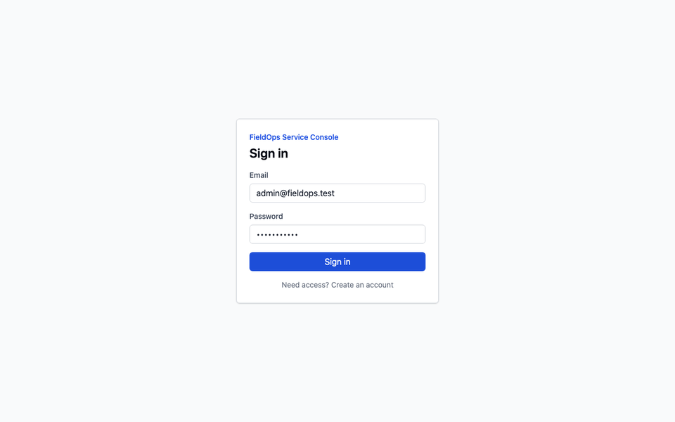
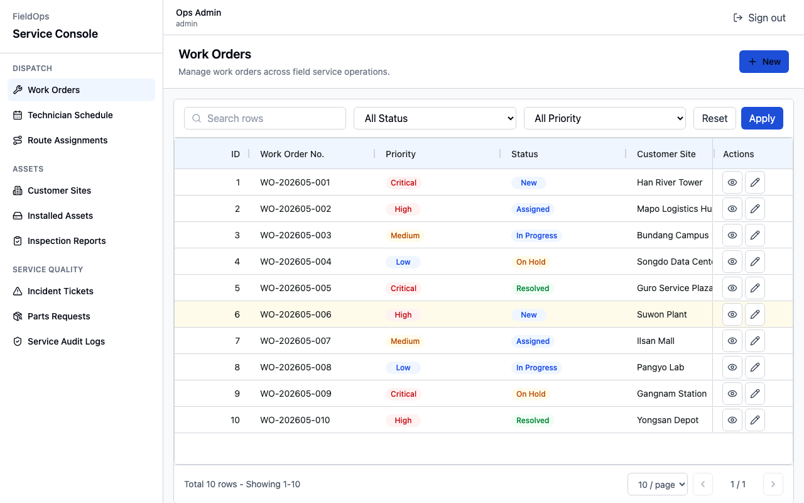
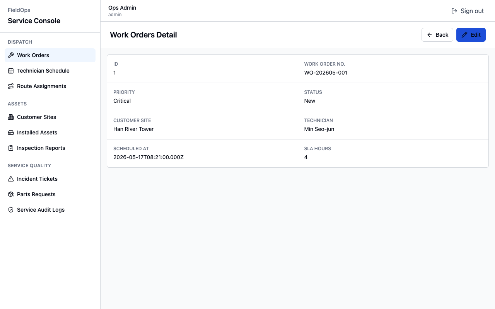
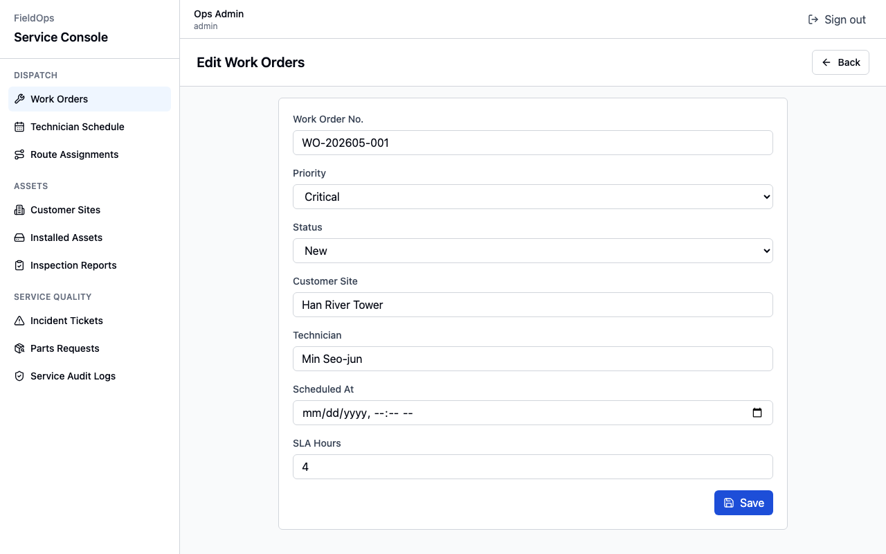

# Web Admin Page Agent Kit

React 기반 admin 웹앱을 생성하기 위한 에이전트 지침 묶음입니다. 최종 산출물은 단순 골격이 아니라, 사용자가 실행하고 이후 디테일을 수정할 수 있는 기본 구동 앱이어야 합니다.

이 폴더는 공개 저장소 초기화용 버전입니다. 프로젝트명, API URL, 인증 seed, 리소스 목록, 실행 리포트, 생성 캐시는 포함하지 않습니다.

## UI Preview

Example output captured from a generated FieldOps Service Console app.



The demo shows the default sign-in flow, generated resource list, search, detail view, and edit form.

| Resource List | Detail View | Edit Form |
| --- | --- | --- |
|  |  |  |

## What It Builds

- Vite + React + TypeScript 기반 admin 앱
- FSD 계층: `app`, `pages`, `widgets`, `features`, `entities`, `shared`
- 대분류/소분류 sidebar navigation과 route map
- resource별 list page, table, pagination, search, filter
- enabled CRUD에 따른 detail/create/update/delete page, mutation, form
- Swagger/OpenAPI 미연동 시 auth/resource mock fallback
- mock rows가 실제 list table에 렌더링되는 runtime list smoke 검증

## Directory Map

```text
repo-root/
  agent.md                  # 실행 지침 입구
  00-04-*.md                # 프로젝트/package/TS/Vite/lint 기준
  input/                    # 프로젝트별 입력값
  workflow/                 # 00-09 실행 단계
  rules/                    # 생성 규칙과 품질 기준
  reports/                  # 실행 후 리포트 및 compact manifests
```

## Quick Start

1. 이 폴더의 내용을 새 프로젝트 루트로 사용하거나, 대상 프로젝트 루트에 복사합니다.
2. `input/README.md`를 읽고 `input/*` 값을 프로젝트에 맞게 채웁니다.
3. 최초 리소스 생성 전 `input/resource-manifest.md`에 메뉴 카테고리와 리소스 라벨을 작성합니다.
4. Codex에게 `agent.md를 읽고 input/index.md 기준으로 admin 앱을 생성해줘.`라고 요청합니다.
5. 의존성 설치가 필요하면 package manager와 설치 목록을 확인한 뒤 승인합니다.
6. 완료 전 lint/typecheck/build/runtime list smoke 결과를 확인합니다.

## Input Files

- `input/project.md`: 프로젝트명, 앱 타입, 기본/지원 언어
- `input/stack.md`: React/Vite/TypeScript/Tailwind 버전, table library, `uiKit`, optional tools
- `input/design.md`: 색상, 폰트, radius, density, style token
- `input/api.md`: API base URL env key, Swagger/OpenAPI URL
- `input/auth.md`: 인증 방식, token storage, 권한 모델, action 목록
- `input/resource-manifest.md`: 최초 리소스 생성용 메뉴 카테고리와 리소스 라벨
- `input/resources/*.md`: materialization 이후 resource source of truth

## Resource Flow

처음에는 `resource-manifest.md`가 리소스 seed 역할을 합니다. `workflow/03-materialize-resources.md` 이후에는 `input/resources/*.md`가 route, API, columns, filters, search, CRUD 설정의 기준입니다. `input/resource-index.json`은 파생 cache file입니다.

## Completion Expectation

- 앱이 실행 가능한 상태여야 합니다.
- Swagger/OpenAPI가 비어 있거나 불완전하면 mock fallback으로 auth와 resource 화면이 동작해야 합니다.
- mock rows가 1개 이상이면 대표 list table에 row/cell이 실제 렌더링되어야 합니다.
- sign-in, sign-up when enabled, sign-out, private-route guard가 기본적으로 동작해야 합니다.

---

# Web Admin Page Agent Kit

This is a bundle of agent instructions for generating React-based admin web apps. The final output should not be a simple skeleton; it should be a runnable baseline app that users can execute and later refine in detail.

This folder is the public repository initialization version. It does not include the project name, API URL, auth seed, resource list, execution reports, or generated caches.

## What It Builds

- A Vite + React + TypeScript admin app
- FSD layers: `app`, `pages`, `widgets`, `features`, `entities`, `shared`
- Sidebar navigation and route map with primary and secondary categories
- Resource-specific list pages, tables, pagination, search, and filters
- Detail/create/update/delete pages, mutations, and forms according to enabled CRUD settings
- Auth/resource mock fallback when Swagger/OpenAPI is not connected
- Runtime list smoke verification that mock rows are rendered in an actual list table

## Directory Map

```text
repo-root/
  agent.md                  # Entry point for execution instructions
  00-04-*.md                # Project/package/TS/Vite/lint standards
  input/                    # Project-specific input values
  workflow/                 # Execution steps 00-09
  rules/                    # Generation rules and quality standards
  reports/                  # Post-run reports and compact manifests
```

## Quick Start

1. Use the contents of this folder as a new project root, or copy them into the target project root.
2. Read `input/README.md` and fill in the `input/*` values for your project.
3. Before generating the initial resources, write the menu categories and resource labels in `input/resource-manifest.md`.
4. Ask Codex: `Read agent.md and generate an admin app based on input/index.md.`
5. If dependency installation is required, confirm the package manager and install list before approving.
6. Before completion, verify the lint/typecheck/build/runtime list smoke results.

## Input Files

- `input/project.md`: Project name, app type, default/supported languages
- `input/stack.md`: React/Vite/TypeScript/Tailwind versions, table library, `uiKit`, optional tools
- `input/design.md`: Colors, font, radius, density, style tokens
- `input/api.md`: API base URL env key, Swagger/OpenAPI URL
- `input/auth.md`: Auth method, token storage, permission model, action list
- `input/resource-manifest.md`: Menu categories and resource labels for initial resource generation
- `input/resources/*.md`: Resource source of truth after materialization

## Resource Flow

At first, `resource-manifest.md` serves as the resource seed. After `workflow/03-materialize-resources.md`, `input/resources/*.md` becomes the source of truth for routes, APIs, columns, filters, search, and CRUD settings. `input/resource-index.json` is a derived cache file.

## Completion Expectation

- The app must be runnable.
- If Swagger/OpenAPI is empty or incomplete, auth and resource screens must work through the mock fallback.
- If there is at least one mock row, the row/cell must be rendered in the representative list table.
- Sign-in, sign-up when enabled, sign-out, and private-route guard must work by default.

---

# Web Admin Page Agent Kit

这是一组用于生成基于 React 的 admin Web 应用的 Agent 指令。最终产物不应只是一个简单骨架，而应该是一个可运行的基础应用，用户可以先运行它，再继续调整细节。

此文件夹是用于公开仓库初始化的版本。不包含项目名、API URL、认证 seed、资源列表、执行报告或生成缓存。

## What It Builds

- 基于 Vite + React + TypeScript 的 admin 应用
- FSD 分层：`app`、`pages`、`widgets`、`features`、`entities`、`shared`
- 带有一级/二级分类的侧边栏导航和路由映射
- 按 resource 生成的列表页、表格、分页、搜索和筛选
- 根据启用的 CRUD 配置生成 detail/create/update/delete 页面、mutation 和表单
- Swagger/OpenAPI 未接入时的 auth/resource mock fallback
- 验证 mock rows 是否实际渲染到 list table 中的 runtime list smoke 检查

## Directory Map

```text
repo-root/
  agent.md                  # 执行指令入口
  00-04-*.md                # 项目/package/TS/Vite/lint 标准
  input/                    # 项目专用输入值
  workflow/                 # 00-09 执行步骤
  rules/                    # 生成规则和质量标准
  reports/                  # 执行后的报告和 compact manifests
```

## Quick Start

1. 将此文件夹内容作为新的项目根目录使用，或复制到目标项目根目录。
2. 阅读 `input/README.md`，并根据项目填写 `input/*` 的值。
3. 在首次生成资源前，在 `input/resource-manifest.md` 中填写菜单分类和资源标签。
4. 向 Codex 请求：`Read agent.md and generate an admin app based on input/index.md.`
5. 如果需要安装依赖，请先确认 package manager 和安装列表，然后再批准。
6. 完成前，请确认 lint/typecheck/build/runtime list smoke 的结果。

## Input Files

- `input/project.md`：项目名、应用类型、默认/支持语言
- `input/stack.md`：React/Vite/TypeScript/Tailwind 版本、table library、`uiKit`、optional tools
- `input/design.md`：颜色、字体、radius、density、style token
- `input/api.md`：API base URL env key、Swagger/OpenAPI URL
- `input/auth.md`：认证方式、token storage、权限模型、action 列表
- `input/resource-manifest.md`：首次生成资源时使用的菜单分类和资源标签
- `input/resources/*.md`：materialization 之后的 resource source of truth

## Resource Flow

最初，`resource-manifest.md` 作为资源 seed。执行 `workflow/03-materialize-resources.md` 之后，`input/resources/*.md` 会成为 route、API、columns、filters、search 和 CRUD 配置的基准。`input/resource-index.json` 是派生的 cache file。

## Completion Expectation

- 应用必须处于可运行状态。
- 如果 Swagger/OpenAPI 为空或不完整，auth 和 resource 页面必须通过 mock fallback 正常工作。
- 如果存在至少 1 条 mock row，代表性的 list table 中必须实际渲染 row/cell。
- sign-in、启用时的 sign-up、sign-out、private-route guard 必须默认可用。
